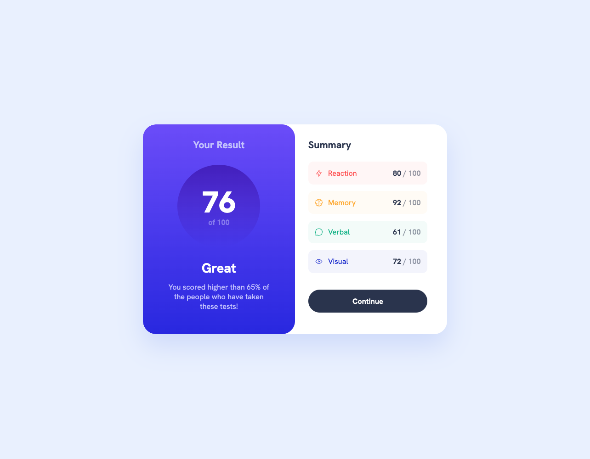

# Frontend Mentor - Results summary component solution

This is a solution to the [Results summary component challenge on Frontend Mentor](https://www.frontendmentor.io/challenges/results-summary-component-CE_K6s0maV).

## Table of contents

- [Overview](#overview)
  - [The challenge](#the-challenge)
  - [Screenshot](#screenshot)
  - [Links](#links)
- [Author](#author)
- [Acknowledgments](#acknowledgments)

## Overview

### The challenge

Users should be able to:

- View the optimal layout for the interface depending on their device's screen size
- See hover and focus states for all interactive elements on the page

### Screenshot

### Links

- Solution URL: [https://joaocln88.github.io/FrontendMentor-ResultsSummaryComponent](https://joaocln88.github.io/FrontendMentor-ResultsSummaryComponent/)

## Author

- Github - [João Corrêa](https://github.com/joaocln88)
- Frontend Mentor - [@joaocln88](https://www.frontendmentor.io/profile/joaocln88)

## Acknowledgments

Thanks to Frontend Mentor, who provided the challange and all useful details to accomplish it.
